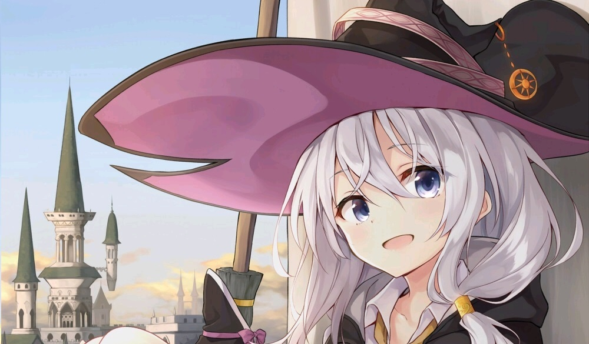
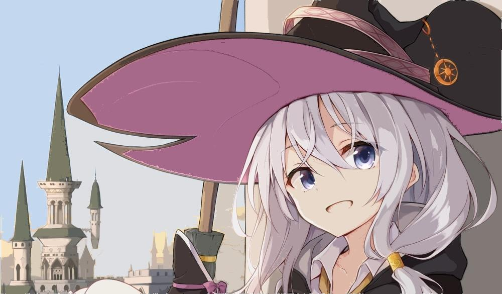

# Introduction

使用Java实现的一个图片处理软件

基础功能：基础功能如调整饱和度、亮度、像素化等 
新功能：实现图像油画风格、厚涂风格等的转换

## 部分功能预览

#### 原图

#### 一键处理后的效果图

风格简化：

## 关于

当前不支持更改分辨率，在分辨率少于1080*800的电脑上运行UI可能会溢出屏幕。

**视频对应源代码请下载color2.java；安装java环境之后可以直接下载.jar文件运行。**

